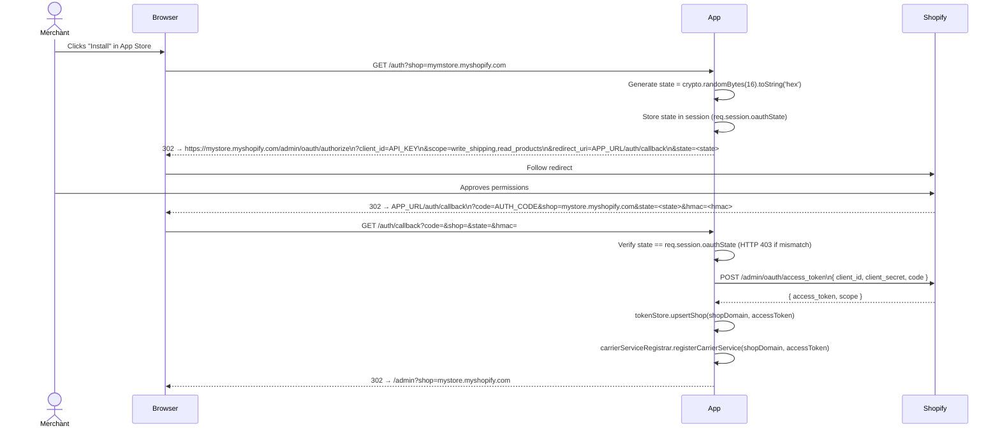
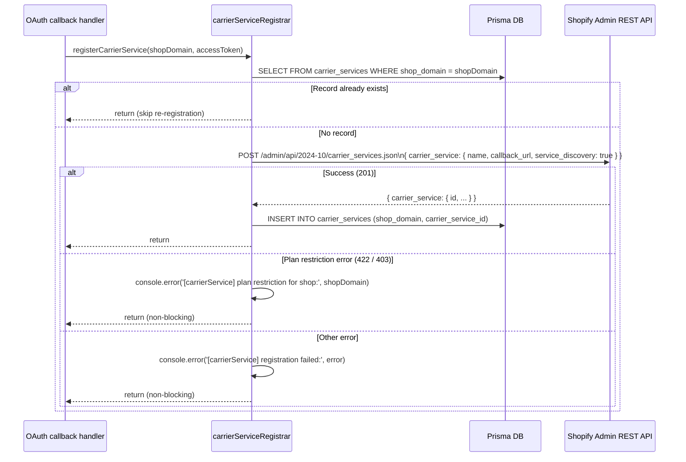

# Design Document — multi-store-shopify-app

## Overview

This document describes converting the existing single-store SFT Shipping Rates Express app into a fully multi-tenant Shopify application. Every merchant that installs the app from the Shopify App Store gets isolated storage, their own Shopify OAuth token, their own settings (currency exchange rates and dimensional weight divisor), and their own CarrierService registration — all served from one shared Node.js process.

The guiding principle throughout is **minimal structural surgery**: all existing business-logic services (`sftClient`, `shopifyAdmin`, `dimensionalWeight`, `mapper`) remain as pure computational units. The multi-tenancy concern is injected at the boundary — each service that previously read from a global config or flat file now receives a `shopContext` object containing the per-shop token and settings, keeping the core logic unchanged and fully testable.

### Key design decisions

| Decision | Choice | Rationale |
|---|---|---|
| Database ORM | Prisma | Type-safe, migration-based, supports both Postgres (prod) and SQLite (dev) from the same schema |
| Session store | `express-session` + in-memory (dev) / DB-backed (prod) | Keeps OAuth callback state across requests without needing Redis; swap store for prod |
| HMAC verification | Node built-in `crypto.timingSafeEqual` | Avoids timing attacks; no new dependency |
| OAuth state | `crypto.randomBytes(16).toString('hex')` stored in server-side session | Prevents CSRF on the OAuth callback |
| CarrierService registration | Async, triggered post-OAuth, non-blocking | Plan restriction errors are logged but don't abort the install |

---

## Architecture

```mermaid
graph TD
    subgraph Shopify
        SHP[Shopify Platform]
        CSC[CarrierService Callback]
        OAU[OAuth Endpoints]
        WHK[Webhooks]
    end

    subgraph App["Node.js / Express App"]
        direction TB
        SRV[server.js]

        subgraph Routes
            AUTH[/auth routes\nOAuth_Handler]
            RATES[/rates route\nRates_Handler]
            ADMIN[/admin routes\nAdmin_Panel]
            WEBHOOKS[/webhooks routes\nWebhook_Handler]
            HEALTH[/health]
        end

        subgraph Middleware
            HMAC_MW[hmacVerify middleware]
            SESSION_MW[session middleware]
            SHOP_AUTH[shopAuth middleware]
        end

        subgraph Services
            SS[settingsStore\nPrisma-backed]
            TS[tokenStore\nPrisma-backed]
            CSR[carrierServiceRegistrar]
            SFT[sftClient]
            SHA[shopifyAdmin]
            DW[dimensionalWeight]
            MAP[mapper]
        end

        DB[(Prisma / SQLite or Postgres)]
    end

    Merchant -->|browser install| AUTH
    SHP --> OAU --> AUTH
    AUTH -->|post-install| CSR
    CSR -->|register /rates URL| SHP
    SHP --> WHK --> WEBHOOKS
    Shopify -->|POST /rates| HMAC_MW --> RATES
    RATES --> SS & TS & SHA & SFT & DW & MAP
    SS & TS --> DB
    ADMIN --> SESSION_MW --> SHOP_AUTH --> SS
```

### Request flows at a glance

1. **Install** — browser → `GET /auth?shop=` → OAuth redirect → Shopify → `GET /auth/callback` → token exchange → DB upsert → CarrierService registration → redirect to `/admin?shop=`
2. **Rate calculation** — Shopify → `POST /rates` (HMAC verified) → load shop token + settings from DB → fetch dimensions → compute weight → call SFT → map → respond
3. **Admin** — browser → `GET /admin?shop=` → session check → serve settings page / handle `POST /admin/settings`
4. **Uninstall** — Shopify → `POST /webhooks/app/uninstalled` (HMAC verified) → mark shop uninstalled in DB

---

## Components and Interfaces

### 1. `src/routes/auth.js` — OAuth_Handler

```
GET /auth?shop={shop_domain}
  → validates shop param, generates state, redirects to Shopify authorize URL

GET /auth/callback?code=&shop=&state=&hmac=
  → verifies state, exchanges code for token, upserts shop in DB,
    triggers CarrierService registration, redirects to /admin?shop=
```

**Interface exported:** none (Express Router, mounted in server.js)

**Dependencies:** `tokenStore`, `carrierServiceRegistrar`, `express-session`

### 2. `src/routes/rates.js` — Rates_Handler (refactored)

```
POST /rates
  Headers: X-Shopify-Hmac-Sha256, X-Shopify-Shop-Domain
  Body: { rate: { origin, destination, items, currency, locale } }
  Response: { rates: [...] }
```

Now accepts a `shopContext` object built from DB data rather than reading global config.

### 3. `src/routes/admin.js` — Admin_Panel (refactored)

```
GET  /admin?shop={shop_domain}     → serve admin.html (session-gated)
GET  /admin/settings?shop=         → return shop's settings JSON
POST /admin/settings?shop=         → validate + save shop's settings
POST /admin/login?shop=            → accepts shop-specific password, creates session
POST /admin/logout                 → destroys session
```

### 4. `src/routes/webhooks.js` — Webhook_Handler

```
POST /webhooks/app/uninstalled
  Headers: X-Shopify-Hmac-Sha256, X-Shopify-Topic, X-Shopify-Shop-Domain
  Body: raw JSON webhook payload
  Response: 200 OK
```

### 5. `src/middleware/hmacVerify.js` — HMAC_Verifier

```js
// Factory that returns an Express middleware
function hmacVerify(secret) → Middleware

// Called by:
//   routes/rates.js    — verifies CarrierService callback
//   routes/webhooks.js — verifies webhook payloads
```

Reads raw body (requires `express.raw()` or buffering before `express.json()`), computes `HMAC-SHA256(body, SHOPIFY_API_SECRET)`, compares to `X-Shopify-Hmac-Sha256` header using `crypto.timingSafeEqual`. Returns HTTP 401 on failure.

**Critical:** `express.json()` must NOT be applied globally before this middleware — raw body must be preserved. A custom body-buffer middleware is used on the `/rates` and `/webhooks` routes.

### 6. `src/middleware/shopAuth.js` — Session-based admin auth

```js
function shopAuth(req, res, next)
  // Checks req.session.shopDomain matches req.query.shop (or req.body.shop)
  // Redirects to /admin/login?shop= if not authenticated
```

### 7. `src/services/tokenStore.js` — Token_Store

```js
async function upsertShop(shopDomain, accessToken) → Shop
async function getShop(shopDomain) → Shop | null
async function markUninstalled(shopDomain) → void
async function isInstalled(shopDomain) → boolean
```

Wraps Prisma `shops` model CRUD.

### 8. `src/services/settingsStore.js` — Settings_Store (refactored)

```js
async function getSettings(shopDomain) → Settings
async function saveSettings(shopDomain, settings) → Settings
async function getCurrencyRate(shopDomain, currencyCode) → {code, rate, pkrPerUsd}
async function getDimensionalWeightDivisor(shopDomain) → number
```

All methods are now `async` and accept `shopDomain`. The flat-file implementation is replaced by Prisma queries. Returns defaults (matching `data/settings.default.json`) when no row exists for the shop.

### 9. `src/services/carrierServiceRegistrar.js` — CarrierService_Registrar

```js
async function registerCarrierService(shopDomain, accessToken) → void
```

Calls `POST /admin/api/{version}/carrier_services.json` on the shop. Persists the returned ID to the `carrier_services` table. Skips if a record already exists. Logs but does not throw on plan-restriction errors.

### 10. `src/services/shopifyAdmin.js` — Shopify_Admin_Client (refactored)

```js
async function fetchProductDimensions(shopDomain, accessToken, productIds) → Record<string, dims>
```

No longer reads from global config. Accepts `shopDomain` and `accessToken` as explicit parameters.

### 11. `src/services/sftClient.js` — SFT_Client (unchanged interface)

```js
async function getRates(params) → SftResponse
```

Unchanged — reads `config.sft` which is still global (SFT credentials are app-level, not per-shop).

### 12. `src/services/dimensionalWeight.js` — unchanged

Pure function, no changes needed.

### 13. `src/services/mapper.js` — unchanged

Pure function, no changes needed.

### 14. `src/config.js` — updated

Adds Shopify app-level OAuth credentials (`SHOPIFY_API_KEY`, `SHOPIFY_API_SECRET`). Removes per-store `SHOPIFY_STORE_DOMAIN` and `SHOPIFY_ADMIN_API_TOKEN` (those move to DB).

---

## Data Models

### Prisma schema (`prisma/schema.prisma`)

```prisma
datasource db {
  provider = "sqlite"   // override to "postgresql" via DATABASE_URL in prod
  url      = env("DATABASE_URL")
}

generator client {
  provider = "prisma-client-js"
}

model Shop {
  shopDomain      String    @id @map("shop_domain")
  accessToken     String?   @map("access_token")
  installedAt     DateTime  @map("installed_at")
  uninstalledAt   DateTime? @map("uninstalled_at")

  settings        Settings?
  carrierService  CarrierService?

  @@map("shops")
}

model Settings {
  shopDomain              String  @id @map("shop_domain")
  currencies              String  @map("currencies")          // JSON string
  dimensionalWeightDivisor Float   @default(5000) @map("dimensional_weight_divisor")

  shop Shop @relation(fields: [shopDomain], references: [shopDomain], onDelete: Cascade)

  @@map("settings")
}

model CarrierService {
  shopDomain       String @id @map("shop_domain")
  carrierServiceId String @map("carrier_service_id")

  shop Shop @relation(fields: [shopDomain], references: [shopDomain], onDelete: Cascade)

  @@map("carrier_services")
}
```

**Notes:**
- `currencies` is stored as a JSON string (SQLite doesn't have a native JSON column; Postgres can use `Json` type — the Prisma client handles `JSON.stringify/parse` in the service layer).
- Cascade deletes ensure that removing a shop row cleans up settings and carrier_service rows.
- `accessToken` is nullable so that an uninstalled shop row can have its token nullified while the row is retained for audit purposes (`uninstalledAt` timestamp).

### Settings object shape (in-memory / API surface)

```json
{
  "currencies": {
    "USD": 1,
    "CAD": 1.36,
    "EUR": 0.92,
    "GBP": 0.79,
    "AUD": 1.52,
    "PKR": 280
  },
  "dimensionalWeightDivisor": 5000
}
```

This matches `data/settings.default.json` exactly — new shops inherit these defaults when no settings row exists.

---

## OAuth Flow Sequence



**State parameter security:** the `state` value is a 16-byte random hex string stored in the server-side session initiated at `GET /auth`. The callback verifies it matches before doing anything else. A mismatch results in HTTP 403 — no token exchange, no DB write.

---

## HMAC Verification Approach

HMAC verification applies to two routes: `POST /rates` (CarrierService callback) and `POST /webhooks/app/uninstalled`. Both use the same middleware factory.

```
Raw body preservation strategy:
  - Routes requiring HMAC use express.raw({ type: '*/*' }) BEFORE express.json()
  - The raw Buffer is attached to req.rawBody by a small middleware
  - hmacVerify reads req.rawBody for the HMAC computation
  - After HMAC passes, express.json() parsing can happen (or the route parses req.rawBody itself)
```

### HMAC computation

```
computedHmac = HMAC-SHA256(rawBodyBuffer, SHOPIFY_API_SECRET)
providedHmac = Buffer.from(req.headers['x-shopify-hmac-sha256'], 'base64')

valid = crypto.timingSafeEqual(computedHmac, providedHmac)
```

`timingSafeEqual` prevents timing-based attacks that could enumerate valid secrets.

If the header is absent, `providedHmac` will be a zero-length buffer — the comparison will fail safely.

### Middleware mounting order in server.js

```
app.use('/rates',    rawBodyMiddleware, hmacVerify(config.shopify.apiSecret), ratesRouter)
app.use('/webhooks', rawBodyMiddleware, hmacVerify(config.shopify.apiSecret), webhooksRouter)
app.use(express.json())   ← only applied globally to routes that don't need raw body
app.use('/auth',    authRouter)
app.use('/admin',   sessionMiddleware, adminRouter)
```

---

## Session-Based Admin Auth Design

### Session setup

```js
app.use(session({
  secret: process.env.SESSION_SECRET,
  resave: false,
  saveUninitialized: false,
  cookie: { httpOnly: true, secure: process.env.NODE_ENV === 'production', maxAge: 8 * 60 * 60 * 1000 }
}))
```

`SESSION_SECRET` is a new required environment variable (random 32-byte hex string).

### Login flow

1. Merchant visits `GET /admin?shop=mystore.myshopify.com`
2. `shopAuth` middleware checks `req.session.shopDomain === req.query.shop`
3. If not authenticated → redirect to `GET /admin/login?shop=mystore.myshopify.com`
4. Merchant submits `POST /admin/login` with shop-specific password (`ADMIN_PASSWORD` env var — same for all shops in this design, can be extended to per-shop passwords via DB later)
5. On success: `req.session.shopDomain = shopDomain` → redirect back to `/admin?shop=`

### Session scoping

Each session is scoped to exactly one `shopDomain` stored in `req.session.shopDomain`. All admin routes check that `req.query.shop` (or `req.body.shop`) matches `req.session.shopDomain`, preventing a session authenticated for Shop A from reading/writing Shop B's settings.

### Replacing Basic Auth

The existing `src/middleware/adminAuth.js` is replaced by `src/middleware/shopAuth.js`. The global `ADMIN_USERNAME` config key is removed; only `ADMIN_PASSWORD` is retained as the admin gate password (shop-agnostic).

---

## CarrierService Registration Flow



The `callback_url` is set to `APP_URL + '/rates'` where `APP_URL` is the `APP_BASE_URL` environment variable.

---

## Webhook Handling Design

### Webhook registration

The `app/uninstalled` webhook is registered for each shop during the OAuth install flow, immediately after CarrierService registration:

```js
await registerWebhook(shopDomain, accessToken, {
  topic: 'app/uninstalled',
  address: `${config.appBaseUrl}/webhooks/app/uninstalled`,
  format: 'json',
})
```

This is a simple REST call to `POST /admin/api/{version}/webhooks.json`.

### Webhook receipt and processing

```
POST /webhooks/app/uninstalled
  1. rawBodyMiddleware preserves body bytes
  2. hmacVerify validates X-Shopify-Hmac-Sha256 → 401 if invalid
  3. Parse JSON body
  4. Extract shop from X-Shopify-Shop-Domain header
  5. tokenStore.markUninstalled(shopDomain)
     → sets uninstalled_at = now(), access_token = null
  6. Respond HTTP 200 immediately
```

The handler must respond within 5 seconds. All DB operations are async/await but are expected to complete well within that window.

### Subsequent /rates calls from uninstalled shops

`Rates_Handler` calls `tokenStore.isInstalled(shopDomain)` as part of shop lookup. If the shop has `uninstalledAt !== null` or `accessToken === null`, it returns `{ rates: [] }` with HTTP 200 — preserving checkout stability.

---

## Adapting Existing Services for Multi-Shop Context

### `sftClient.js` — no changes required

SFT credentials are app-level secrets (one account services all shops). The service continues reading from `config.sft`.

### `dimensionalWeight.js` — no changes required

Pure function with no I/O. Takes `(items, dimensionsByProductId, divisor)` — the `divisor` is now passed in from the per-shop settings loaded by `Rates_Handler`.

### `mapper.js` — no changes required

Pure function. Takes `(shopifyRateRequest, chargeableWeightKg)` and `(sftResponse, targetCurrency)`. The `targetCurrency` object (with `rate` and `pkrPerUsd`) continues to come from `settingsStore`, which is now per-shop.

### `shopifyAdmin.js` — signature change only

The single change is adding `shopDomain` and `accessToken` as parameters, removing the read from `config.shopify.storeDomain` and `config.shopify.adminApiToken`:

```js
// Before
async function fetchProductDimensions(productIds)

// After
async function fetchProductDimensions(shopDomain, accessToken, productIds)
```

The GraphQL query body, timeout logic, mock mode, and response parsing are all unchanged.

### `settingsStore.js` — full rewrite (flat-file → Prisma)

Same public API shape, but all functions become `async` and take `shopDomain` as the first argument. The `fs` dependency is removed entirely. Default-fallback logic moves from file-copy to in-memory object comparison against `DEFAULTS` constant (matching `data/settings.default.json`).

---

## New File/Module Structure

```
sft-shipping-app/
├── prisma/
│   ├── schema.prisma              ← NEW: DB models
│   └── migrations/                ← NEW: auto-generated by prisma migrate
├── src/
│   ├── server.js                  ← MODIFIED: add session, new routes, body-buffer strategy
│   ├── config.js                  ← MODIFIED: add SHOPIFY_API_KEY, SHOPIFY_API_SECRET, SESSION_SECRET, APP_BASE_URL
│   ├── db.js                      ← NEW: PrismaClient singleton
│   ├── middleware/
│   │   ├── adminAuth.js           ← REMOVED (replaced by shopAuth.js)
│   │   ├── shopAuth.js            ← NEW: session-based shop auth
│   │   └── hmacVerify.js          ← NEW: HMAC verification factory
│   ├── routes/
│   │   ├── auth.js                ← NEW: GET /auth, GET /auth/callback
│   │   ├── rates.js               ← MODIFIED: shop-aware, HMAC-verified
│   │   ├── admin.js               ← MODIFIED: session-gated, shop-scoped
│   │   └── webhooks.js            ← NEW: POST /webhooks/app/uninstalled
│   └── services/
│       ├── tokenStore.js          ← NEW: Prisma-backed shop CRUD
│       ├── settingsStore.js       ← MODIFIED: async, shop-scoped, Prisma-backed
│       ├── carrierServiceRegistrar.js ← NEW: post-install registration
│       ├── sftClient.js           ← UNCHANGED
│       ├── shopifyAdmin.js        ← MODIFIED: accepts shopDomain + accessToken params
│       ├── dimensionalWeight.js   ← UNCHANGED
│       └── mapper.js              ← UNCHANGED
├── data/
│   └── settings.default.json      ← UNCHANGED (used as defaults constant source)
├── public/
│   └── admin.html                 ← LIGHTLY MODIFIED: add shop param to API calls
└── scripts/
    └── registerCarrierService.js  ← DEPRECATED (registration now automatic post-install)
```

---

## Environment Variable Changes

### Removed variables

| Variable | Reason |
|---|---|
| `SHOPIFY_STORE_DOMAIN` | Moved to DB (per-shop) |
| `SHOPIFY_ADMIN_API_TOKEN` | Moved to DB (per-shop) |
| `CARRIER_SERVICE_CALLBACK_URL` | Derived from `APP_BASE_URL + '/rates'` |
| `ADMIN_USERNAME` | Session auth doesn't use username |

### Added variables

| Variable | Required | Description |
|---|---|---|
| `SHOPIFY_API_KEY` | Yes | App client ID from Shopify Partner Dashboard |
| `SHOPIFY_API_SECRET` | Yes | App client secret — used for HMAC and token exchange |
| `APP_BASE_URL` | Yes | Public HTTPS base URL (e.g. `https://yourapp.railway.app`) |
| `SESSION_SECRET` | Yes | Random 32+ byte string for signing session cookies |
| `DATABASE_URL` | Yes (prod) | Postgres connection string (`postgresql://...`) or SQLite path (`file:./dev.db`) |

### Retained variables

| Variable | Change |
|---|---|
| `PORT` | Unchanged |
| `SFT_BASE_URL` | Unchanged |
| `SFT_API_KEY` | Unchanged |
| `SFT_CREDENTIALS` | Unchanged |
| `SFT_MOCK_MODE` | Unchanged |
| `SHOPIFY_API_VERSION` | Unchanged |
| `SHOPIFY_ADMIN_MOCK_MODE` | Unchanged |
| `ADMIN_PASSWORD` | Retained as shop-agnostic admin panel password |

### Updated `.env.example`

```env
PORT=3000

# Shopify App credentials (from Partner Dashboard)
SHOPIFY_API_KEY=your_api_key
SHOPIFY_API_SECRET=your_api_secret
SHOPIFY_API_VERSION=2024-10
APP_BASE_URL=https://your-app-url.railway.app

# Session
SESSION_SECRET=change_me_to_32_random_bytes_hex

# Admin panel
ADMIN_PASSWORD=change_me

# Database (SQLite for dev, Postgres for prod)
DATABASE_URL=file:./dev.db

# SFT API
SFT_BASE_URL=https://smartcourier.pk/api
SFT_API_KEY=
SFT_CREDENTIALS=
SFT_MOCK_MODE=true

# Mock modes
SHOPIFY_ADMIN_MOCK_MODE=true
```

---

## Migration Strategy (Single-Store → Multi-Store)

### Phase 1 — Add Prisma, run migration

1. `npm install @prisma/client express-session`
2. `npm install --save-dev prisma`
3. Create `prisma/schema.prisma` with the three models above.
4. For local dev: `DATABASE_URL=file:./dev.db npx prisma migrate dev --name init`
5. For production: set `DATABASE_URL` to Postgres, run `npx prisma migrate deploy` on startup or in CI.

### Phase 2 — Seed existing store data (optional but recommended)

If the operator is the sole current merchant, their access token can be inserted directly:

```js
// scripts/seedExistingShop.js  (one-time migration helper)
const { PrismaClient } = require('@prisma/client');
const prisma = new PrismaClient();
await prisma.shop.upsert({
  where: { shopDomain: process.env.SHOPIFY_STORE_DOMAIN },
  create: {
    shopDomain: process.env.SHOPIFY_STORE_DOMAIN,
    accessToken: process.env.SHOPIFY_ADMIN_API_TOKEN,
    installedAt: new Date(),
    settings: {
      create: {
        currencies: JSON.stringify(existingSettings.currencies),
        dimensionalWeightDivisor: existingSettings.dimensionalWeightDivisor,
      }
    }
  },
  update: { accessToken: process.env.SHOPIFY_ADMIN_API_TOKEN }
});
```

This script is run once, before the old env vars are removed.

### Phase 3 — Deploy and verify

1. Deploy to Railway/Render with new env vars set.
2. Hit `GET /health` — verify response includes `{ status: 'ok', ... }`.
3. Re-install app on the existing store via the OAuth flow (acquires new token with correct scopes).
4. Verify CarrierService appears in the store's Shipping settings.
5. Remove `SHOPIFY_STORE_DOMAIN` and `SHOPIFY_ADMIN_API_TOKEN` from environment.

### Rollback plan

Because `settings.json` is not deleted (only stopped being read), and Prisma migrations are additive, rolling back means redeploying the previous git tag with the old env vars. No data is at risk.

---

## Correctness Properties

*A property is a characteristic or behavior that should hold true across all valid executions of a system — essentially, a formal statement about what the system should do. Properties serve as the bridge between human-readable specifications and machine-verifiable correctness guarantees.*

### Property 1: OAuth state verification is a strict equality check

*For any* randomly generated OAuth state string, the state verifier SHALL accept that exact string and SHALL reject any other string (including the empty string, similar strings differing by one character, or strings of different length).

**Validates: Requirements 1.3, 1.4**

---

### Property 2: Shop install upsert — no duplicate rows

*For any* shop domain and access token, calling `upsertShop` two or more times SHALL result in exactly one row in the `shops` table for that domain, with the most recent access token stored.

**Validates: Requirements 1.5, 1.6**

---

### Property 3: Settings round-trip

*For any* settings object where `currencies` is a non-empty map of currency codes to positive numbers and `dimensionalWeightDivisor` is a positive number, saving then reading back the settings for any shop domain SHALL return an object equivalent to the original.

**Validates: Requirements 2.7, 6.6**

---

### Property 4: Missing-settings default fallback

*For any* shop domain that has no settings row in the database, `settingsStore.getSettings(shopDomain)` SHALL return an object identical to the contents of `data/settings.default.json` (currencies map matching the defaults and `dimensionalWeightDivisor` of 5000).

**Validates: Requirements 2.3, 2.5**

---

### Property 5: HMAC verification correctness

*For any* request body bytes and the correct app secret, `hmacVerify` SHALL compute the same HMAC-SHA256 digest as `crypto.createHmac('sha256', secret).update(body).digest()`, accept requests where the header matches this digest, and reject requests where the header contains any other value (including the correct digest computed with a different secret).

**Validates: Requirements 3.1, 3.2, 5.1**

---

### Property 6: Shop data isolation

*For any* two distinct shop domains A and B, saving settings for shop A SHALL NOT change the settings returned for shop B, and vice versa.

**Validates: Requirements 2.2, 6.1, 6.6**

---

### Property 7: Settings validation rejects invalid inputs

*For any* `currencies` object where at least one value is zero or negative (or `currencies` is an empty object), settings validation SHALL return a failure result. *For any* `currencies` object where all values are strictly positive numbers and `dimensionalWeightDivisor` is a strictly positive number, settings validation SHALL return a success result.

**Validates: Requirements 6.4, 6.5**

---

### Property 8: Dimensional weight invariant

*For any* list of cart items with known dimensions and weights and any positive divisor, `computeChargeableWeightKg` SHALL return a value that is greater than or equal to both `totalActualKg` and `totalDimensionalKg`, and equal to `max(totalActualKg, totalDimensionalKg)`.

**Validates: Requirements 8.1, 8.2**

---

### Property 9: Mapper currency conversion

*For any* SFT response entry with `pkAmount > 0` and any positive `pkrPerUsd` and `usdToTargetRate`, the `total_price` field in the mapped Shopify rate SHALL equal `String(Math.round(pkAmount / pkrPerUsd * usdToTargetRate * 100))`.

**Validates: Requirements 8.3, 8.5**

---

### Property 10: Mapper structural completeness

*For any* valid SFT response (where `success === true` and `data` is a non-empty array), `mapSftResponseToShopifyRates` SHALL return an array of length equal to `data.length`, where every entry contains non-null `service_name`, `service_code`, `total_price`, `currency`, and `description` fields, and `total_price` is a string whose numeric value is a non-negative integer.

**Validates: Requirements 8.4, 8.5, 8.7**

---

### Property 11: Mapper invalid-response safety

*For any* SFT response object where `success !== true` OR `data` is not an array (including `null`, `undefined`, an empty object, or an array-shaped payload with `success: false`), `mapSftResponseToShopifyRates` SHALL return an empty array `[]` without throwing.

**Validates: Requirements 8.6**

---

### Property 12: Uninstall nullifies token and sets timestamp

*For any* installed shop domain, calling `tokenStore.markUninstalled(shopDomain)` SHALL result in the shop record having `accessToken === null` and `uninstalledAt` set to a non-null timestamp, and `tokenStore.isInstalled(shopDomain)` SHALL return `false` afterwards.

**Validates: Requirements 5.3, 5.4**

---

## Error Handling

| Scenario | Behaviour |
|---|---|
| OAuth state mismatch | HTTP 403, no token stored, error logged |
| Token exchange failure (Shopify API error) | HTTP 500 redirect to error page, error logged |
| CarrierService registration fails (plan restriction) | Log error, continue OAuth flow, HTTP 302 to admin |
| CarrierService registration fails (other) | Log error, continue OAuth flow |
| Webhook HMAC invalid | HTTP 401, no DB changes |
| `/rates` HMAC invalid | HTTP 401, no rate logic runs |
| Shop not found / uninstalled on `/rates` | HTTP 200, `{"rates": []}` |
| SFT API timeout (7s) | Log error, return `{"rates": []}` |
| Shopify Admin API timeout (5s) | Log error, fall back to actual weight only, return rates |
| Missing product dimensions | Log warning per item, fall back to actual weight for that item |
| Invalid SFT response shape | Return `{"rates": []}` |
| Settings save fails (DB error) | HTTP 500 with error body |
| Session secret not set | App fails startup with clear error message |
| DATABASE_URL missing in Postgres mode | App fails startup with clear error message |

---

## Testing Strategy

### Dual approach

Unit tests cover specific examples and edge cases; property tests verify universal correctness across a wide input space. The two complement each other — unit tests catch concrete known bugs, property tests find unexpected edge cases.

### Property-based testing

The Node.js PBT library for this project is **[fast-check](https://github.com/dubzzz/fast-check)** (`npm install --save-dev fast-check`). Each property test runs a minimum of 100 iterations.

Each test is tagged with a comment referencing the design property:
```js
// Feature: multi-store-shopify-app, Property 8: Dimensional weight invariant
```

Properties to implement as fast-check tests:

| Property | Module under test | fast-check arbitraries |
|---|---|---|
| P1 — OAuth state equality | `auth.js` (state verifier extracted) | `fc.hexaString(32)` |
| P2 — Shop upsert idempotence | `tokenStore.js` | `fc.domain()`, `fc.hexaString(40)` |
| P3 — Settings round-trip | `settingsStore.js` | `fc.record({ currencies: fc.dictionary(...), divisor: fc.float({min:1}) })` |
| P4 — Default fallback | `settingsStore.js` | `fc.domain()` (not pre-seeded) |
| P5 — HMAC correctness | `hmacVerify.js` | `fc.uint8Array()`, `fc.hexaString(32)` |
| P6 — Shop data isolation | `settingsStore.js` | Two distinct `fc.domain()` values |
| P7 — Settings validation | `admin.js` (validator extracted) | `fc.record({ currencies: ..., divisor: fc.float() })` |
| P8 — Dimensional weight invariant | `dimensionalWeight.js` | `fc.array(fc.record({ grams, quantity, dims }))` |
| P9 — Currency conversion | `mapper.js` | `fc.float({min:0.01})` for amounts and rates |
| P10 — Mapper structural completeness | `mapper.js` | `fc.array(fc.record({ sft entry fields }))` |
| P11 — Mapper invalid-response safety | `mapper.js` | `fc.anything()` — any value that isn't a valid response |
| P12 — Uninstall state transition | `tokenStore.js` | `fc.domain()` |

### Unit / integration tests

- **OAuth handler**: example-based tests using `supertest` + mocked Shopify token endpoint (nock). Covers state mismatch → 403, valid flow → DB upsert + redirect.
- **Admin routes**: example-based tests for login, settings GET/POST, session scoping, HTTP 400 on invalid input.
- **Rates route**: example-based tests for HMAC rejection, unknown shop, mock SFT + mock Shopify Admin producing expected `rates` array.
- **Webhook route**: example-based test for HMAC rejection and successful uninstall → `markUninstalled` called.
- **Health endpoint**: smoke test — `GET /health` returns 200 with correct flags.

### Test database

Property and unit tests use an in-memory SQLite database (`DATABASE_URL=file::memory:?cache=shared`). Each test suite runs `prisma migrate deploy` against the in-memory DB, then cleans up between tests using `prisma.$executeRaw('DELETE FROM ...')` or table truncation helpers.
