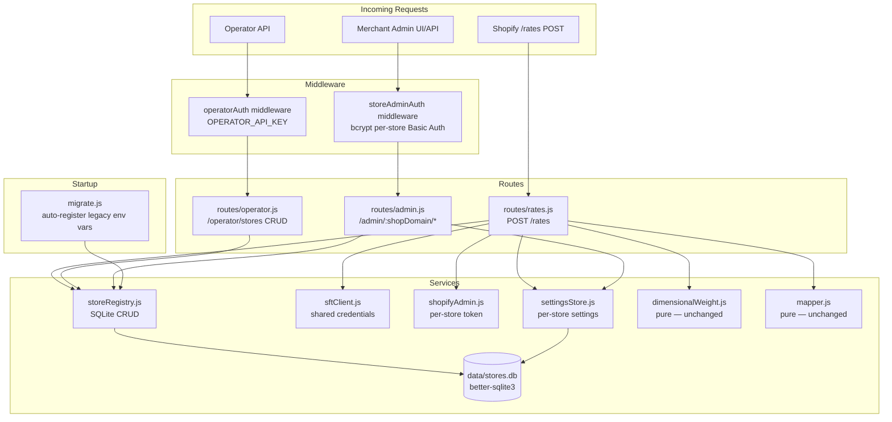
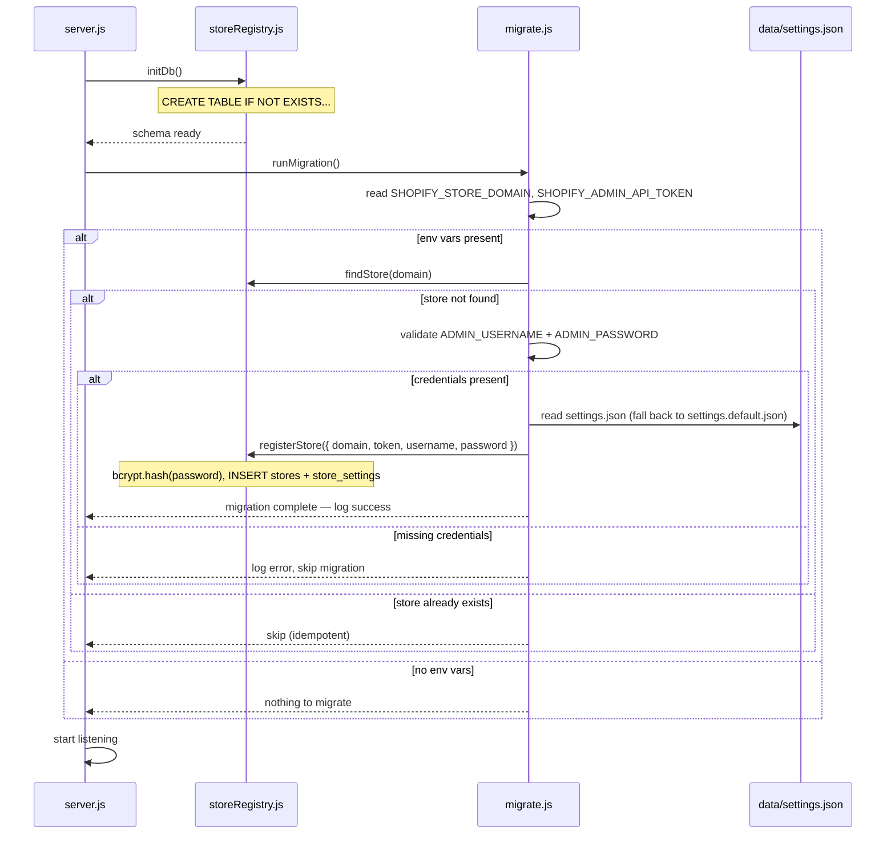
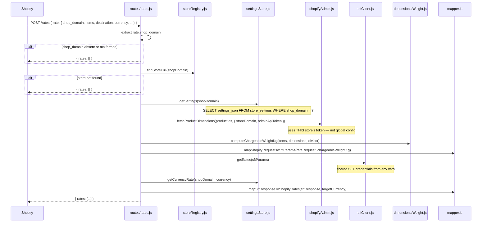

# Design Document: Multi-Store Support

## Overview

This design extends the SFT Shipping Rates backend from a single-store architecture to a multi-store architecture. The core challenge is routing each incoming Shopify `/rates` callback to the correct per-store context (API token, settings, admin credentials) while keeping stores strictly isolated from one another.

The approach is deliberately minimal: no external database server, no new web framework, no clustering. A SQLite file (`data/stores.db`) replaces the flat `settings.json`, an operator API (protected by a separate env-var key) manages store CRUD, and every existing concept (settings, admin UI, carrier service registration) is lifted from global-singleton to per-`shopDomain`.

Key design decisions:
- **`better-sqlite3`** for synchronous SQLite — keeps the existing synchronous settings pattern and avoids callback/Promise complexity in a single-instance app.
- **`bcryptjs`** (pure-JS, no native build) for password hashing — avoids `node-gyp` build issues that plague `bcrypt` on Windows.
- **Operator API key** (env var `OPERATOR_API_KEY`) guards store CRUD; no per-store credentials are used for that surface.
- **Auto-migration** on startup converts legacy env-var config into the first Store_Record transparently.

---

## Architecture



### Component Responsibilities

| Component | Role |
|---|---|
| `storeRegistry.js` | All SQLite reads/writes for Store_Records; owns schema creation and migration |
| `routes/operator.js` | Operator CRUD API (list, register, delete stores) |
| `routes/rates.js` | Updated to resolve shop_domain → Store_Record before delegating to existing pipeline |
| `routes/admin.js` | Updated to route on `:shopDomain` path param, load per-store settings |
| `middleware/operatorAuth.js` | Checks `Authorization: Bearer <OPERATOR_API_KEY>` |
| `middleware/storeAdminAuth.js` | HTTP Basic Auth against bcrypt hash from the Store_Record for the requested `:shopDomain` |
| `services/shopifyAdmin.js` | Updated to accept `{ storeDomain, adminApiToken, adminMockMode }` as a parameter instead of reading from global config |
| `services/settingsStore.js` | Updated to read/write settings from SQLite by `shopDomain` instead of flat JSON file |
| `migrate.js` | Runs once on startup — if legacy env vars exist and no DB record, auto-registers |

---

## Components and Interfaces

### `src/services/storeRegistry.js` (new)

Central data-access layer for Store_Records. Uses `better-sqlite3` (synchronous API).

```js
// Opens/creates data/stores.db and runs schema migrations.
// Called once during server startup.
function initDb(): void

// Returns a store record by domain, or null if not found.
// NEVER returns adminApiToken or passwordHash to callers outside this module
// unless explicitly using the internal variant.
function findStore(shopDomain: string): StorePublicRecord | null

// Internal variant — returns the full record including token and hash.
// Only used by storeAdminAuth middleware and the rates router (needs token).
function findStoreFull(shopDomain: string): StoreFullRecord | null

// Registers a new store. Throws on duplicate shop_domain (UNIQUE constraint).
// Hashes password with bcryptjs before writing.
// Seeds store_settings from settings.default.json in the same transaction.
function registerStore(params: {
  shopDomain: string,
  adminApiToken: string,
  adminUsername: string,
  adminPassword: string   // plaintext — hashed internally
}): void

// Deletes a store and its settings atomically. Throws if not found.
function deleteStore(shopDomain: string): void

// Returns array of { shopDomain } objects — no tokens or hashes.
function listStores(): Array<{ shopDomain: string }>

// Type definitions (JSDoc, not TypeScript):
// StorePublicRecord = { shopDomain, adminUsername, createdAt }
// StoreFullRecord   = { shopDomain, adminApiToken, adminUsername, passwordHash, createdAt }
```

### `src/services/settingsStore.js` (modified)

Replaces flat-file reads/writes with SQLite. Keeps the same exported function signatures so callers need minimal changes.

```js
// Returns parsed settings JSON for a store, or null if store not found.
function getSettings(shopDomain: string): SettingsObject | null

// Persists settings for a store. Throws if store not found.
// Returns the saved settings object.
function saveSettings(shopDomain: string, newSettings: SettingsObject): SettingsObject

// Unchanged signature — now reads from DB.
function getCurrencyRate(shopDomain: string, currencyCode: string): CurrencyRateResult

// Unchanged signature — now reads from DB.
function getDimensionalWeightDivisor(shopDomain: string): number
```

### `src/services/shopifyAdmin.js` (modified)

Removes dependency on global `config.shopify`. Accepts store credentials as a parameter so it can serve any store.

```js
// storeDomain and adminApiToken come from the Store_Record, not global config.
// adminMockMode still falls back to SHOPIFY_ADMIN_MOCK_MODE env var if not provided.
async function fetchProductDimensions(
  productIds: string[],
  storeContext: { storeDomain: string, adminApiToken: string, adminMockMode?: boolean }
): Promise<Record<string, Dimensions | null>>
```

### `src/middleware/operatorAuth.js` (new)

```js
// Reads Authorization: Bearer <token> header.
// Compares against process.env.OPERATOR_API_KEY (exact string match).
// Returns 401 if missing/invalid, 500 if OPERATOR_API_KEY env var is not set.
function operatorAuth(req, res, next): void
```

### `src/middleware/storeAdminAuth.js` (new)

```js
// Reads :shopDomain from req.params.shopDomain.
// Looks up the Store_Record (full, including passwordHash).
// Decodes HTTP Basic Auth header, runs bcrypt.compare(password, hash).
// Returns 404 if store not found, 401 if credentials wrong/absent.
function storeAdminAuth(req, res, next): void
```

### `src/routes/operator.js` (new)

Operator-level store management. All routes require `operatorAuth`.

```
POST   /operator/stores           — register a new store
GET    /operator/stores           — list all stores (no tokens/hashes)
DELETE /operator/stores/:shopDomain — delete a store
```

### `src/routes/rates.js` (modified)

```js
router.post('/rates', async (req, res) => {
  // 1. Extract rate.shop_domain — return { rates: [] } if absent/malformed
  // 2. storeRegistry.findStoreFull(shopDomain) — return { rates: [] } if null
  // 3. settingsStore.getSettings(shopDomain) — load per-store settings
  // 4. shopifyAdmin.fetchProductDimensions(productIds, { storeDomain, adminApiToken })
  // 5-6. Existing dimensional weight + SFT pipeline (unchanged)
})
```

### `src/routes/admin.js` (modified)

Routes restructured from `/admin/*` to `/admin/:shopDomain/*`. `adminAuth` middleware replaced by `storeAdminAuth`.

```
GET  /admin/:shopDomain           — serve admin.html (storeAdminAuth)
GET  /admin/:shopDomain/settings  — get settings (storeAdminAuth)
POST /admin/:shopDomain/settings  — update settings (storeAdminAuth)
```

### `src/migrate.js` (new)

```js
// Reads SHOPIFY_STORE_DOMAIN, SHOPIFY_ADMIN_API_TOKEN, ADMIN_USERNAME, ADMIN_PASSWORD.
// If domain + token are set AND storeRegistry.findStore(domain) is null:
//   - Validates ADMIN_USERNAME and ADMIN_PASSWORD are non-empty; logs error + skips if not.
//   - Calls storeRegistry.registerStore() with settings seeded from data/settings.json
//     (falls back to data/settings.default.json if settings.json is absent).
//   - Logs confirmation on success.
// If store already exists, does nothing (idempotent).
function runMigration(): void
```

### `src/config.js` (modified)

- Removes `shopify.storeDomain`, `shopify.adminApiToken`, `admin.username`, `admin.password` (now per-store in DB).
- Adds `operator.apiKey` from `OPERATOR_API_KEY`.
- Retains `sft.*`, `shopify.apiVersion`, `shopify.adminMockMode`, `port`.

### `scripts/registerCarrierService.js` (modified)

Adds CLI argument parsing for `--shop-domain`, `--admin-api-token`, `--callback-url` (falling back to env vars for each). Uses `process.argv` parsing — no new dependency needed.

---

## Data Models

### SQLite Schema (`data/stores.db`)

```sql
-- Stores table: one row per registered Shopify store
CREATE TABLE IF NOT EXISTS stores (
    shop_domain       TEXT PRIMARY KEY NOT NULL,   -- e.g. "example.myshopify.com"
    admin_api_token   TEXT NOT NULL,               -- Shopify Admin API token
    admin_username    TEXT NOT NULL,
    password_hash     TEXT NOT NULL,               -- bcrypt hash, $2b$ prefix
    created_at        INTEGER NOT NULL DEFAULT (unixepoch())
);

-- Store settings: one row per store, settings stored as JSON blob
CREATE TABLE IF NOT EXISTS store_settings (
    shop_domain       TEXT PRIMARY KEY NOT NULL
                        REFERENCES stores(shop_domain) ON DELETE CASCADE,
    settings_json     TEXT NOT NULL                -- JSON: { currencies, dimensionalWeightDivisor }
);

-- Index for fast lookups (PRIMARY KEY already creates an index, but explicit for clarity)
-- shop_domain is already the PK on both tables, so no additional index needed.
```

The `ON DELETE CASCADE` on `store_settings` means deleting from `stores` automatically removes the corresponding settings row — no two-step delete required (though `deleteStore()` uses a transaction anyway for explicitness).

### Settings JSON Shape (unchanged from current `settings.json`)

```json
{
  "currencies": {
    "USD": 1,
    "CAD": 1.36,
    "EUR": 0.92,
    "GBP": 0.79,
    "AUD": 1.52,
    "PKR": 280
  },
  "dimensionalWeightDivisor": 5000
}
```

---

## API Endpoints

### Operator API (protected by `Authorization: Bearer <OPERATOR_API_KEY>`)

| Method | Path | Body | Response | Description |
|--------|------|------|----------|-------------|
| `POST` | `/operator/stores` | `{ shop_domain, shopify_admin_api_token, admin_username, admin_password }` | `201 { shop_domain }` or `400`/`409` | Register a new store |
| `GET` | `/operator/stores` | — | `200 [ { shop_domain } ]` | List all registered stores (no tokens/hashes) |
| `DELETE` | `/operator/stores/:shopDomain` | — | `200 { deleted: true }` or `404` | Remove a store and its settings |

Error responses follow `{ "error": "<message>" }`.

### Per-Store Admin API (protected by per-store HTTP Basic Auth via `storeAdminAuth`)

| Method | Path | Auth | Response | Description |
|--------|------|------|----------|-------------|
| `GET` | `/admin/:shopDomain` | Basic (per-store) | `200 text/html` | Serve admin.html for this store |
| `GET` | `/admin/:shopDomain/settings` | Basic (per-store) | `200 { currencies, dimensionalWeightDivisor }` | Get this store's settings |
| `POST` | `/admin/:shopDomain/settings` | Basic (per-store) | `200 { currencies, dimensionalWeightDivisor }` or `400` | Update this store's settings |

### Carrier Service Endpoint (no auth — called by Shopify)

| Method | Path | Body | Response | Description |
|--------|------|------|----------|-------------|
| `POST` | `/rates` | Shopify CarrierService request body | `{ rates: [...] }` | Returns shipping rates for the store identified by `rate.shop_domain` |

### Health Check

| Method | Path | Response |
|--------|------|----------|
| `GET` | `/health` | `{ status: "ok", sftMockMode, shopifyAdminMockMode, registeredStores: N }` |

---

## Authentication Design

### Operator API Key

```
OPERATOR_API_KEY=<random-high-entropy-secret>   # set in .env
```

`operatorAuth` middleware reads `Authorization: Bearer <token>` and does a strict string comparison against `process.env.OPERATOR_API_KEY`. If `OPERATOR_API_KEY` is not set at startup, the server logs a warning and the operator routes return `500` on every call (fail-safe).

### Per-Store HTTP Basic Auth

`storeAdminAuth` middleware:
1. Reads `:shopDomain` from `req.params`.
2. Calls `storeRegistry.findStoreFull(shopDomain)` — returns `404` if not found.
3. Decodes the `Authorization: Basic <base64>` header — returns `401 + WWW-Authenticate` if absent.
4. Runs `bcryptjs.compare(submittedPassword, record.passwordHash)` — returns `401` if false.
5. Sets `req.storeRecord = record` so downstream handlers don't re-query.

This ensures credentials for store A cannot authenticate to store B's routes: the hash in step 4 comes from B's Store_Record, not A's.

### bcrypt Work Factor

`bcryptjs.hash(password, 10)` — saltRounds=10. This is sufficient for admin dashboard access and completes in ~100 ms, which is acceptable for a manual login flow.

---

## Migration / Startup Logic



---

## Data Flow: `/rates` Request (Multi-Store)



---

## New and Modified Files

### New Files

| File | Purpose |
|------|---------|
| `src/services/storeRegistry.js` | SQLite data-access layer for Store_Records (all DB operations) |
| `src/routes/operator.js` | Operator CRUD API — register, list, delete stores |
| `src/middleware/operatorAuth.js` | Bearer token middleware for operator routes |
| `src/middleware/storeAdminAuth.js` | Per-store bcrypt Basic Auth middleware |
| `src/migrate.js` | Startup migration: env-var single-store → first Store_Record |

### Modified Files

| File | Changes |
|------|---------|
| `src/server.js` | Call `initDb()` + `runMigration()` before `app.listen()`; mount `operatorRouter` |
| `src/config.js` | Remove per-store fields (`storeDomain`, `adminApiToken`, `admin.*`); add `operator.apiKey` |
| `src/routes/rates.js` | Resolve `shop_domain` → Store_Record; pass `storeContext` to `shopifyAdmin` and `settingsStore` |
| `src/routes/admin.js` | Restructure routes to `/admin/:shopDomain/*`; replace `adminAuth` with `storeAdminAuth` |
| `src/services/settingsStore.js` | Replace flat-file reads/writes with SQLite; add `shopDomain` parameter to all exports |
| `src/services/shopifyAdmin.js` | Accept `storeContext` parameter; remove dependency on global `config.shopify` |
| `src/middleware/adminAuth.js` | Deprecated — replaced by `storeAdminAuth.js`; file can be deleted |
| `scripts/registerCarrierService.js` | Add CLI argument parsing (`--shop-domain`, `--admin-api-token`, `--callback-url`) |

### Unchanged Files

| File | Reason |
|------|--------|
| `src/services/dimensionalWeight.js` | Pure computation, no external dependencies |
| `src/services/mapper.js` | Pure mapping, no external dependencies |
| `src/services/sftClient.js` | Shared SFT credentials remain global — no per-store changes needed |
| `public/admin.html` | The HTML/JS already fetches `/admin/settings` dynamically; only the fetch URL needs to change (prepend `/:shopDomain`) — a minimal JS change in the file |
| `data/settings.default.json` | Used as seed data for new stores; not modified |

---

## Correctness Properties

*A property is a characteristic or behavior that should hold true across all valid executions of a system — essentially, a formal statement about what the system should do. Properties serve as the bridge between human-readable specifications and machine-verifiable correctness guarantees.*

### Property 1: Store Registration Round-Trip

*For any* valid combination of shop domain, admin API token, admin username, and admin password, calling `registerStore()` followed by `findStoreFull(shopDomain)` should return a record with the same shop domain, token, and username, and a non-empty password hash that is distinct from the plaintext password.

**Validates: Requirements 1.1, 1.7, 8.1**

---

### Property 2: Default Settings Seeded on Registration

*For any* newly registered store, calling `getSettings(shopDomain)` immediately after registration should return a settings object equal to the contents of `settings.default.json` (same currency keys and same dimensional weight divisor).

**Validates: Requirements 1.6**

---

### Property 3: Duplicate Registration Rejected

*For any* valid shop domain, registering that domain a second time should throw an error (or return an error response) indicating the store already exists, and the original Store_Record should remain unchanged.

**Validates: Requirements 1.2**

---

### Property 4: Password Stored as bcrypt Hash

*For any* plaintext password string, the value stored in `password_hash` after `registerStore()` should satisfy `bcrypt.compare(plaintext, hash) === true` and should not equal the plaintext string.

**Validates: Requirements 1.7**

---

### Property 5: Store Listing Completeness and Safety

*For any* set of N distinct registered shop domains, `listStores()` should return a list containing exactly those N domains, with no additional entries and no entries for deleted stores. Furthermore, no element in the returned list should contain an `adminApiToken` or `passwordHash` field.

**Validates: Requirements 2.1, 2.4, 11.3, 11.4**

---

### Property 6: Delete Then Lookup Returns Not-Found

*For any* registered shop domain, calling `deleteStore(shopDomain)` followed by `findStore(shopDomain)` should return `null`, and `getSettings(shopDomain)` should return `null`.

**Validates: Requirements 2.2**

---

### Property 7: Store Isolation in Rate Routing

*For any* two distinct registered stores A and B, when a `/rates` request arrives with `rate.shop_domain` set to A's domain, the system should use A's `adminApiToken` and A's settings for the entire request lifecycle — it should never load or use B's `adminApiToken` or B's settings during that request.

**Validates: Requirements 3.2, 3.6, 7.1, 7.2, 11.1, 11.2**

---

### Property 8: Unknown Domain Returns Empty Rates

*For any* shop domain string that is not registered in the Store_Registry, a `/rates` POST request with that domain in `rate.shop_domain` should return `{ "rates": [] }` without calling the SFT API.

**Validates: Requirements 3.3**

---

### Property 9: Settings Update Isolation

*For any* two distinct registered stores A and B, updating the settings for store A (via `saveSettings(A, newSettings)`) should leave store B's settings completely unchanged.

**Validates: Requirements 4.6, 11.1**

---

### Property 10: Currency Validation Rejects Non-Positive Rates

*For any* settings update request where the `currencies` object contains at least one entry whose value is not a positive number (zero, negative, string, null, etc.), the `POST /admin/:shopDomain/settings` endpoint should reject the request with HTTP 400 and an error message identifying the offending currency code, and the existing settings should remain unchanged.

**Validates: Requirements 4.3, 4.4**

---

### Property 11: Cross-Store Credential Denial

*For any* two distinct registered stores A and B, presenting store A's admin credentials on a request targeting `/admin/B/*` routes should result in HTTP 401, regardless of whether A's credentials are valid for A.

**Validates: Requirements 5.4, 11.1**

---

## Error Handling

### `/rates` Endpoint

| Condition | Behavior |
|-----------|----------|
| `rate.shop_domain` absent | Return `{ rates: [] }`, no log |
| `rate.shop_domain` malformed (wrong type) | Return `{ rates: [] }`, log warning with raw value |
| `shop_domain` not in registry | Return `{ rates: [] }`, no log (expected for unknown stores) |
| Shopify Admin API timeout/error | Return `{ rates: [] }`, log warning with shop domain |
| SFT API timeout/error | Return `{ rates: [] }`, log error |
| Missing product dimension metafields | Soft-fail: use actual weight only, log warning |

### Operator API

| Condition | Status | Response |
|-----------|--------|----------|
| Missing/invalid `OPERATOR_API_KEY` | 401 | `{ error: "Unauthorized" }` |
| `OPERATOR_API_KEY` env var not set | 500 | `{ error: "Operator API not configured" }` |
| Duplicate `shop_domain` | 409 | `{ error: "Store already registered" }` |
| Missing required fields | 400 | `{ error: "<field> is required" }` |
| Store not found on DELETE | 404 | `{ error: "Store not found" }` |

### Per-Store Admin API

| Condition | Status | Response |
|-----------|--------|----------|
| Store not found | 404 | `{ error: "Store not found" }` |
| Missing/invalid credentials | 401 + `WWW-Authenticate` | `Authentication required` |
| Credentials valid for wrong store | 401 + `WWW-Authenticate` | `Invalid credentials` |
| Invalid settings body | 400 | `{ error: "<descriptive message>" }` |

### Database Errors

`storeRegistry.js` catches SQLite-level errors and re-throws them as typed Error subclasses (`StoreNotFoundError`, `StoreDuplicateError`) so route handlers can map them to appropriate HTTP status codes without parsing error messages.

---

## Testing Strategy

### Unit Tests (example-based)

Cover specific behaviors with concrete inputs:
- `storeRegistry`: CRUD operations with known inputs, schema creation, migration logic
- `settingsStore`: `getSettings`/`saveSettings` round-trip for a single known store
- `storeAdminAuth`: correct store granted, wrong store denied, missing header → 401
- `operatorAuth`: valid key passes, invalid key returns 401, missing env var returns 500
- `migrate.js`: with all env vars present → store registered; store already exists → no overwrite; missing `ADMIN_PASSWORD` → skip with log

Edge cases to cover explicitly:
- Absent `rate.shop_domain` → `{ rates: [] }`
- Malformed `shop_domain` (number, array) → `{ rates: [] }` with log
- Empty currencies object → 400
- Zero/negative currency rate → 400
- `dimensionalWeightDivisor` = 0 → 400
- Delete non-existent store → 404

### Property-Based Tests

Use **fast-check** (JavaScript property-based testing library). Each test runs a minimum of **100 iterations**.

Tag format for each test: `// Feature: multi-store-support, Property N: <property_text>`

**Property 1 — Store Registration Round-Trip**
Generate: random `shopDomain` (string matching `*.myshopify.com` pattern), random token string, random username, random password.
Assert: `findStoreFull(domain).shopDomain === domain`, `.adminApiToken === token`, `.adminUsername === username`, `.passwordHash !== password`, `passwordHash` starts with `$2b$`.

**Property 2 — Default Settings Seeded**
Generate: random valid `shopDomain`.
Assert: `getSettings(domain)` deep-equals the parsed contents of `settings.default.json`.

**Property 3 — Duplicate Registration Rejected**
Generate: random valid `shopDomain`, random credentials.
Assert: first call succeeds; second call throws/rejects with a message containing "already" or "exists", and the original record is unchanged after the failed second attempt.

**Property 4 — Password Stored as bcrypt Hash**
Generate: random plaintext password (varying length, special chars, unicode).
Assert: `bcrypt.compare(plaintext, storedHash) === true` and `storedHash !== plaintext`.

**Property 5 — Store Listing Completeness and Safety**
Generate: list of 1–20 distinct `shopDomain` strings.
Assert: `listStores()` returns exactly those domains (set equality). No element has `adminApiToken` or `passwordHash` keys.

**Property 6 — Delete Then Lookup Returns Not-Found**
Generate: random valid `shopDomain`.
Assert: after `registerStore` then `deleteStore`, `findStore(domain) === null` and `getSettings(domain) === null`.

**Property 7 — Store Isolation in Rate Routing**
Generate: two distinct registered stores A and B with different tokens.
Assert: a mock `/rates` call for store A invokes `shopifyAdmin.fetchProductDimensions` with `storeContext.adminApiToken === A.token` (never B's token), and loads settings from A's row only.

**Property 8 — Unknown Domain Returns Empty Rates**
Generate: random domain string guaranteed not in the registry (use unique prefix per run).
Assert: mock POST to `/rates` returns `{ rates: [] }` and the mock SFT client was never called.

**Property 9 — Settings Update Isolation**
Generate: two distinct stores A and B, random new settings object for A.
Assert: `saveSettings(A, newSettings)` followed by `getSettings(B)` returns B's original settings unchanged.

**Property 10 — Currency Validation Rejects Non-Positive Rates**
Generate: random `currencies` object where at least one value is ≤ 0 (or non-number).
Assert: POST `/admin/:shopDomain/settings` returns 400 with an error body containing the offending currency code, and `getSettings(shopDomain)` still returns the pre-existing settings.

**Property 11 — Cross-Store Credential Denial**
Generate: two distinct stores A and B with independent random credentials.
Assert: HTTP Basic Auth request to `/admin/B/settings` using A's credentials returns 401.

---

## Dependencies

### New npm Packages

| Package | Version | Purpose |
|---------|---------|---------|
| `better-sqlite3` | `^9.x` | Synchronous SQLite — replaces flat JSON file; no async complexity; works in single-instance Node |
| `bcryptjs` | `^2.x` | Pure-JS bcrypt — password hashing; no native build required (avoids `node-gyp` issues) |

### Development / Test Packages

| Package | Version | Purpose |
|---------|---------|---------|
| `fast-check` | `^3.x` | Property-based testing library for JavaScript |
| A test runner (e.g. `vitest` or `jest`) | latest | Test runner — project currently has none; `vitest` is recommended for its speed and ESM/CJS compatibility |

### Install Commands

```bash
npm install better-sqlite3 bcryptjs
npm install --save-dev fast-check vitest
```
